# GAN-based Sketch AI

This repository presents a PyTorch implementation of a GAN-based Sketch AI, an image-to-image translation model designed to convert line images into sketched versions of them.

The architecture, training procedure and loss scheme are inspired by several papers.

- Generator: A tweaked version of the generator proposed in [3]. While maintaing *Encoder-Decoder* architecture, replaced most of convolutional layers with residual blocks and some other layers have also been added, omitted, or modified to have different number of channels.
- Discriminator: Use [PatchGAN](https://github.com/junyanz/pytorch-CycleGAN-and-pix2pix/blob/9f8f61e5a375c2e01c5187d093ce9c2409f409b0/models/networks.py#L539) discriminators at three different scales as proposed in [2], to better capture both global style and local strokes.
- Use vanilla PatchGAN loss complemented by a perceptual loss derived from VGG-19 to capture the style of pencil drawings, as proposed in [2]. These losses are scaled to have approximately the same order of magnitude, in order to have them to contribute equally to the training process.

Due to the challenge of acquiring a sufficient dataset for training such GAN-based model, this project extensively augments the dataset by overlapping multiple images, adjusting the line thickness in each of them, and applying a set of affine transformations during data loading.

# Quick Start
1. Download the pretraind models from the link below and place them in `models/`.
(Discriminator models are also included for further training, if desired.)
```
https://drive.google.com/drive/folders/12bioFhYBESkoTuV2vCWUPUob4wX6_4iF?usp=sharing
```

2. Launch Gradio app:
```
python patch_inference.py
```

3. *(Optional)* Launch another Gradio app that extract lines from an input image. This should be useful when converting an image into a line image or  adjusting line thickness.
```
python line_extractor.py
```

4. Input a line image to convert. Adjust `Patch Size` and `Model Size` until you get the best result (The app does not inference the entire image at once. Rather, to get clearer & finer result, it performs inference on multiple cropped patches of `Patch Size`, which are then resized to `Model Size` and fed to the model.)

# Train from Scratch
1. Download the pretrained VGG-19 model from the link below and place it in `data/`.
```
https://drive.google.com/file/d/1JNrSVZrK4TfC7pFG-r7AOmGvBXF2VFOt/view?usp=sharing
```
2. Prepare pairs of line and sketch images. Place line images in `data/raw/` and sketch images in `data/sketch`. A pair of associated images must have the same filename.
3. Run `python train.py` (You can also customize the training configurations. See `train.py`.)

# Results
The model was trained for 1600 epochs on a dataset comprising 42 pairs of line & sketch images, and it took about 6 hours with RTX 4090.  
The line images are borrowed from the dataset of [DifferSketching](https://chufengxiao.github.io/DifferSketching/#dataset) ([Download Link](https://drive.google.com/file/d/1A_3RVc8Y4YdI7nhyM7tb-q7dQw4zTcCO/view)). Corresponding sketch images were drawn by my sister.

During training, the model generated following images given (augmented) line images. Compare to the ground truths, it shows fair quality.
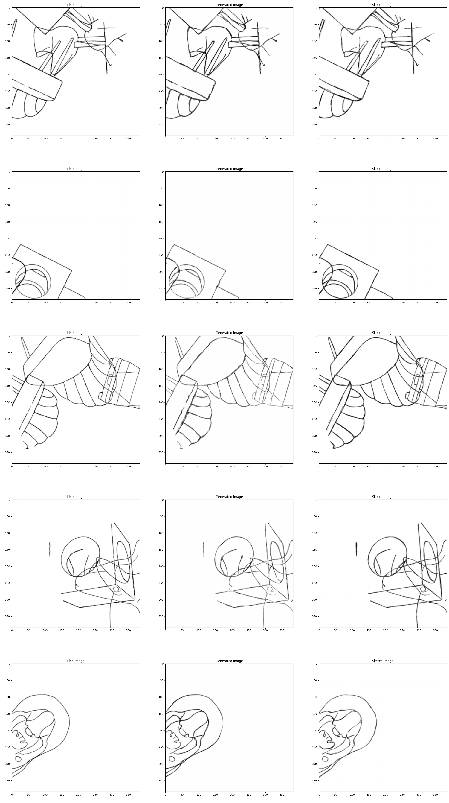

After the training is completed, below are examples of images inferred from line images crawled from the internet or generated using stable diffusion models:
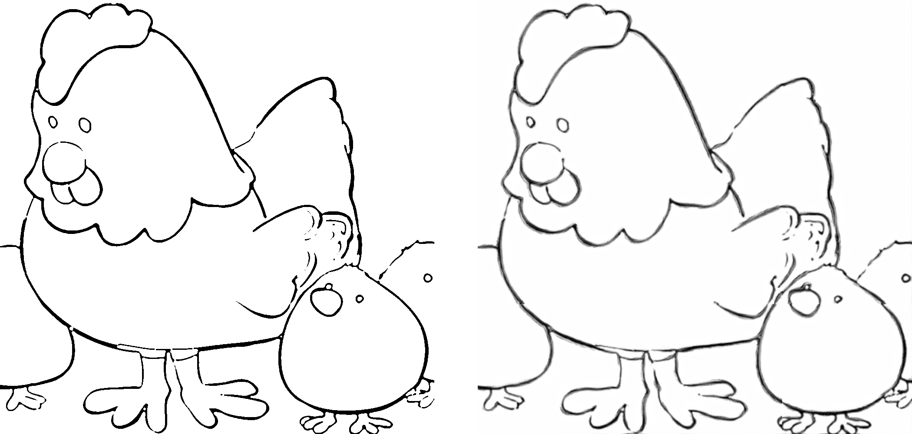
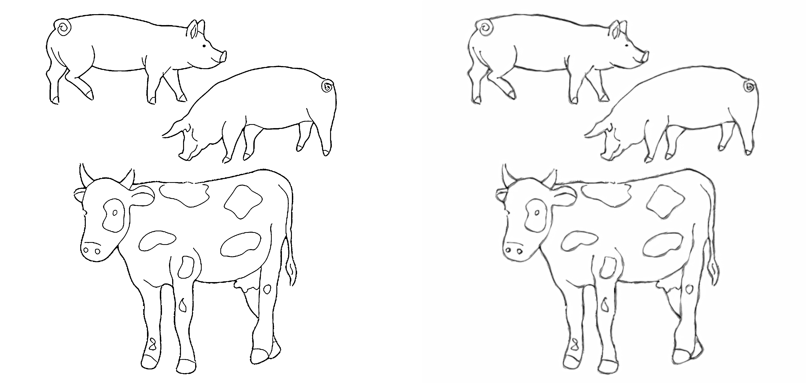
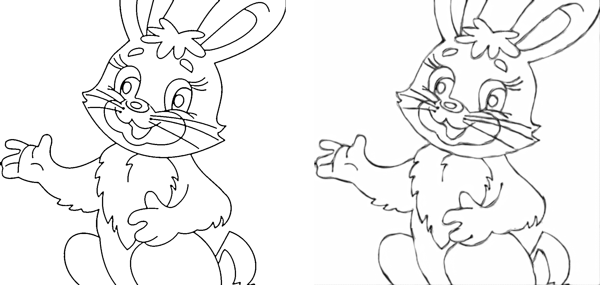
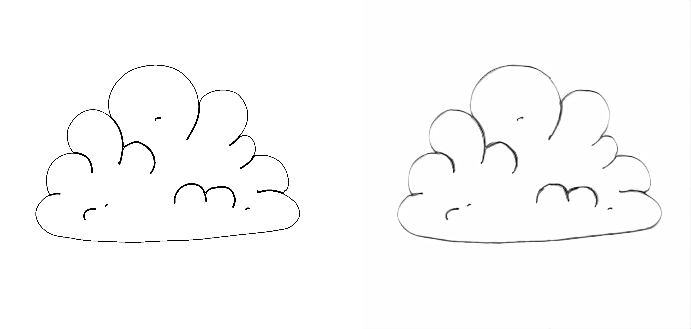
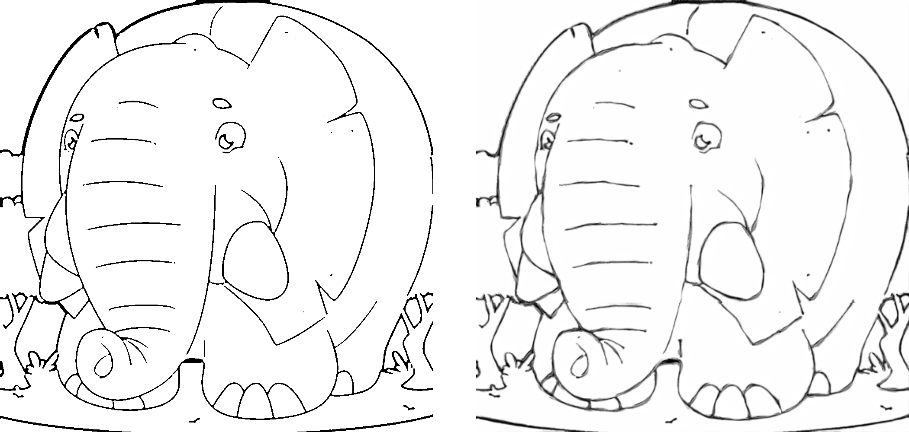
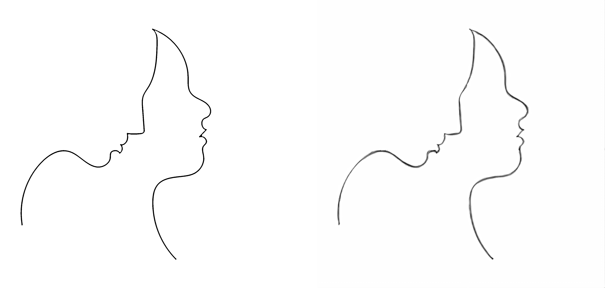
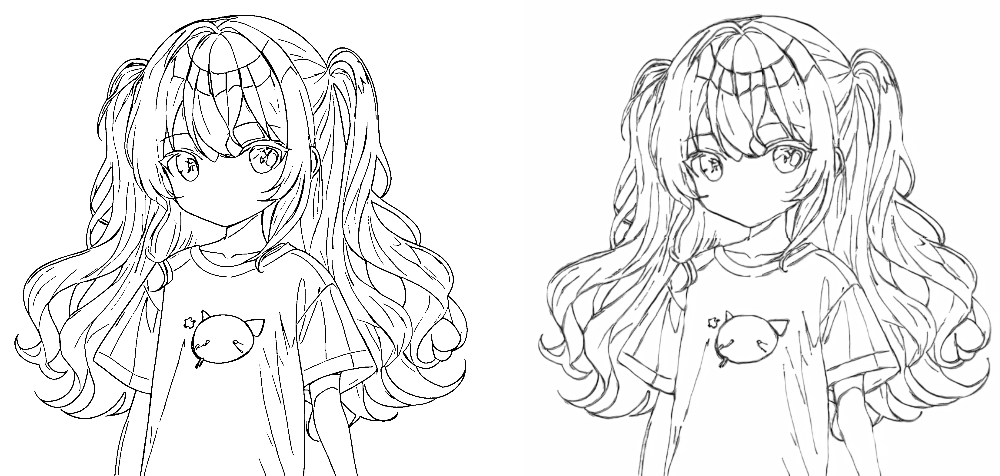
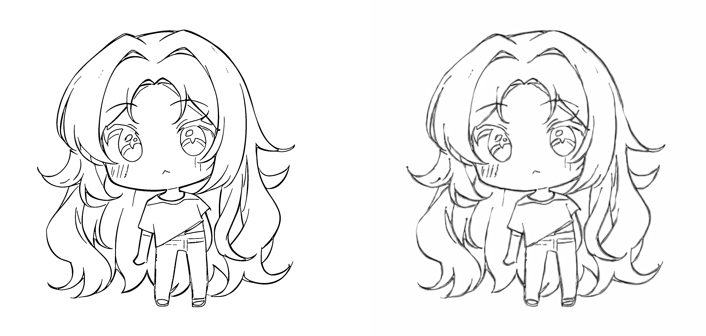
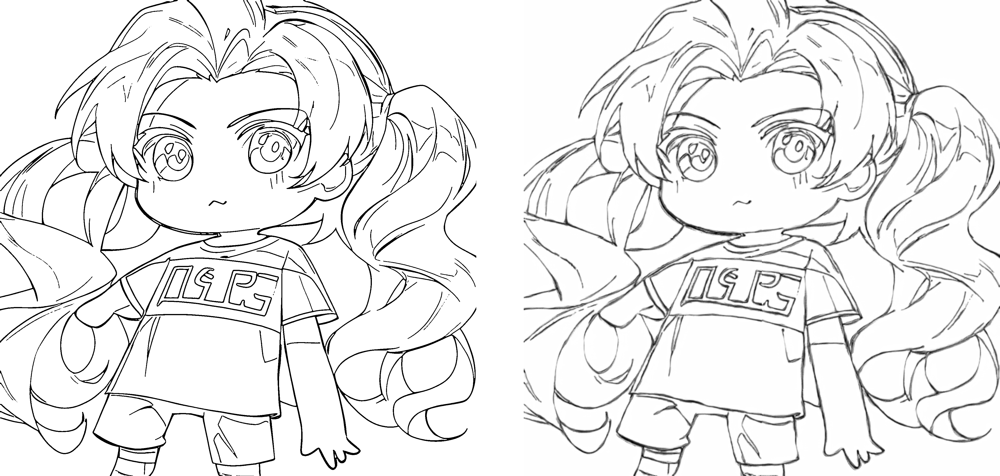
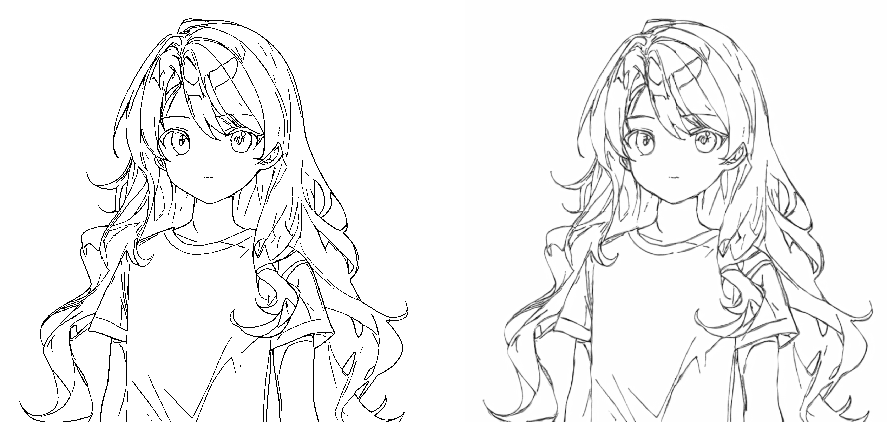
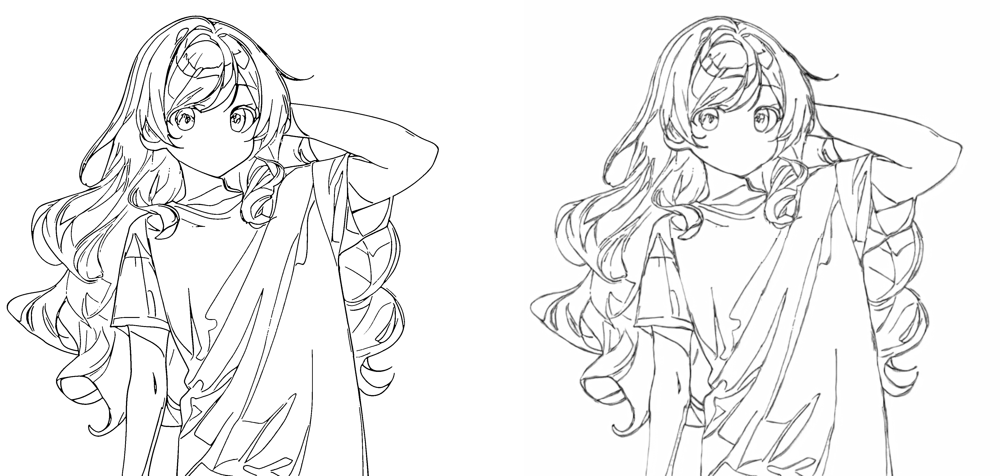

# TODO
- [ ] Try [UNET](https://arxiv.org/abs/1505.04597) for better generator.
- [ ] Introduce *Adversarial augmentation* framwork proposed in [1] to incorporate unsupervised dataset.

# References
[1] Edgar Simo-Serra, Satoshi Iizuka, Hiroshi Ishikawa: “Mastering Sketching: Adversarial Augmentation for Structured Prediction”, 2017; [http://arxiv.org/abs/1703.08966 arXiv:1703.08966].  
[2] Yijun Li, Chen Fang, Aaron Hertzmann, Eli Shechtman, Ming-Hsuan Yang: “Im2Pencil: Controllable Pencil Illustration from Photographs”, 2019; [http://arxiv.org/abs/1903.08682 arXiv:1903.08682].  
[3] Edgar Simo-Serra, Satoshi Iizuka, Kazuma Sasaki, Hiroshi Ishikawa: "Learning to simplify: fully convolutional networks for rough sketch cleanup", 2016; [https://dl.acm.org/doi/10.1145/2897824.2925972].  
